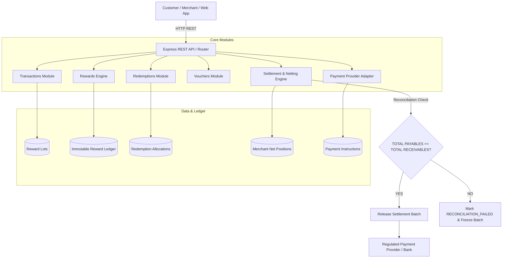

# System Architecture - Sharon Settlement Engine

## Architecture Paradigm: Modular Monolith

Sharon is designed as a clean **Modular Monolith** in TypeScript to ensure low latency, transaction integrity, and auditability without microservice operational complexity for V1.

## Architectural Distinction Table

| Concept | Explanation | Real Money Movement? |
| :--- | :--- | :--- |
| **Reward Entitlement** | Customer's record of unredeemed reward value earned. | ❌ No |
| **Merchant Funding Obligation** | Accounting obligation owed by merchant who generated the reward. | ❌ No |
| **Merchant Receivable** | Credit owed to merchant who provided benefit to customer. | ❌ No |
| **Settlement Instruction** | Audited netting instruction emitted by Sharon engine. | ❌ No |
| **Actual Money Movement** | Direct bank/UPI transfer between merchant/customer accounts via regulated payment rails. | ✅ Yes (Handled by Provider) |
